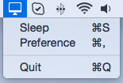

# DisplaySleep

This is a menubar utility that puts your display to sleep with simple clicks.

The setup works on OS X 10.10. I have not tested it on other OS X versions.

The icons are from [this link](https://www.iconfinder.com/search/?q=monitor). Here I acknowledge the icon authors' contribution.

Here are two screenshots for the application.

Here is the icon for this application.

